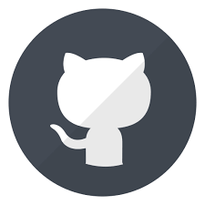

  

<!--Header
#  ɪ'ᴍ Nghiem! 
*Software Engineer (Fontend Web / Mobile(Flutter)*
  

<!--Start Intro-->               

I am a Software Engineer with a huge love for Dart(Mobile), Js and ReactJs. 

- 🌱 I have graduated in Information Technology, I believe that everyday is a learning opportunity.
- ❤ Contributing to Open Source.
- 💻 Sent mail for me <a hefl="">nghiemV2001@gmail.com</a> for more details about work.

<!--Contact Section--> 

<h2 align="center">🤝 Cᴏɴɴᴇᴄᴛ Wɪᴛʜ Mᴇ 🤝 </h2>

